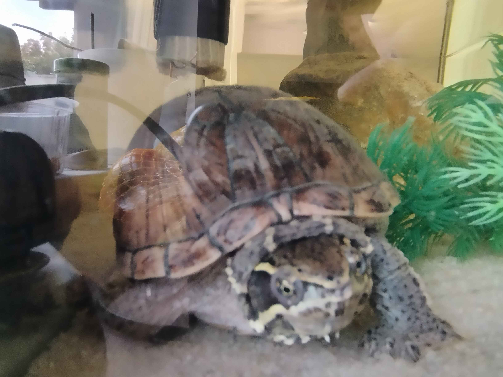

AUTOMATIC TURTLE FEEDER
=========================
- 12-day worry free feeding for your turtle 
- able to edit feed time and current time
- settings for configuring alignment in case of offset error

<!--  -->


## Loading the feeder 
This is how almost fully loaded feeder looks like 


## Display with menu 
Display in the back with menu alloww for simple configuration


### How to build PlatformIO based project

1. [Install PlatformIO Core](https://docs.platformio.org/page/core.html)
2. Download [development platform with examples](https://github.com/platformio/platform-raspberrypi/archive/develop.zip)
3. Extract ZIP archive
4. Run these commands:

```shell
# Change directory to example
$ cd platform-raspberrypi/examples/arduino-blink

# Build project
$ pio run

# Upload firmware
$ pio run --target upload

# Clean build files
$ pio run --target clean
```
